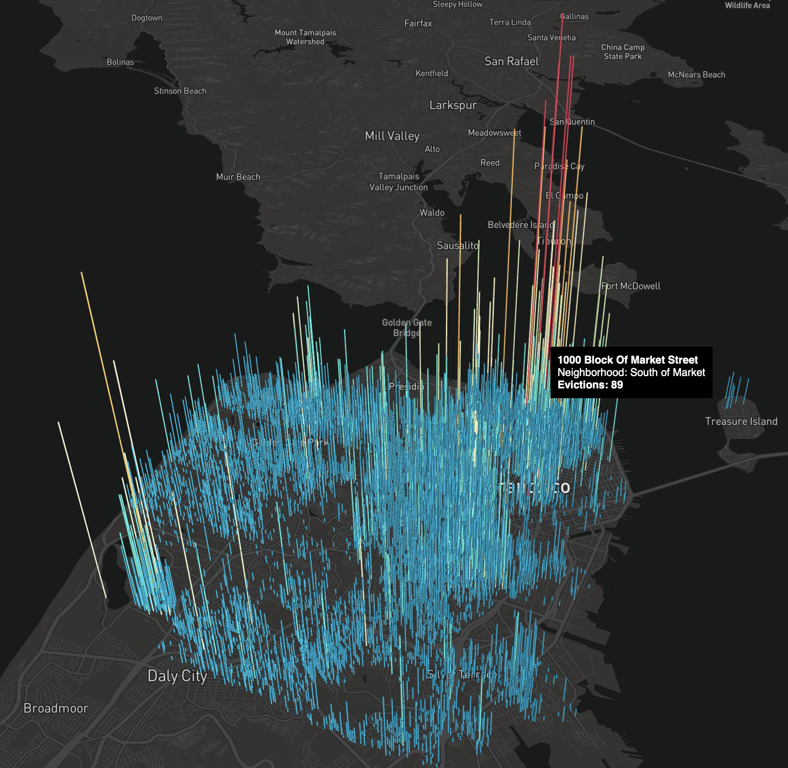

# Evictions in San Fransisco 3D Geospatial Visualization 

### using Deck.gl, Mapbox, and Open SFData.



### Project Description:

###### Due to the novel Covid-19 pandemic, millions of people in the U.S have filed for unemployment leaving many individuals and families in these communities wondering how they will pay their rents. Concentrating on the city of San Francisco, this data visualization depicts the number of evictions in each neighborhood over time from 1997 to present day. This visual hopes to provide a clear illustration on which communities were most impacted by evictions due to Covid-19.

### Local Usage Instructions:

Fork and clone this repository.

To see the base map, you need a [Mapbox access token](https://docs.mapbox.com/help/how-mapbox-works/access-tokens/). You can either set an environment variable:

```bash
export MapboxAccessToken=<mapbox_access_token>
```

Or set `MAPBOX_TOKEN` directly in `app.js`.

Other options can be found at [using with Mapbox GL](../../../docs/get-started/using-with-mapbox-gl.md).

```bash
# install dependencies
npm install
# or
yarn
# bundle and serve the app with webpack
npm start
```

### Data format

Sample data is stored in [deck.gl Example Data](https://github.com/leerach/sf-evictions/blob/master/data/Eviction_Notices.geojson). To use your own data, check out
the [documentation of HexagonLayer](../../../docs/layers/hexagon-layer.md)
